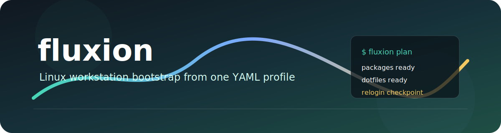

<p align="center">
  
</p>

<p align="center">
  <a href="https://github.com/worxbend/fluxion/actions/workflows/release.yml"></a>
  <a href="https://github.com/worxbend/fluxion/actions/workflows/ci.yml"></a>
  
  
  
  
</p>

<p align="center">
  <b>Turn a fresh Linux machine into your machine.</b><br>
  One YAML file. One preview. One run. CLI or TUI. No mystery bash soup.
</p>

---

## What Is Fluxion?

`fluxion` is a friendly workstation bootstrapper.

You write a YAML profile that says:

- which packages you want
- which installer should handle them: `apt`, `dnf`, `pacman`, `zypper`, Flatpak, direct binary downloads, shell installers, Nerd Fonts, dotfiles, or commands
- which jobs depend on other jobs
- where restart or logout checkpoints belong
- what should be skipped when state or live probes show it is already installed

Then Fluxion shows you what it is about to do and runs the matching work for the current machine.

Think of it like:

> "Here is my developer laptop recipe. Please apply only the parts that make sense on this distro."

## Why It Exists

Fresh machines are exciting for about five minutes. Then you remember you need Git, Zsh, Docker,
Flatpak apps, `kubectl`, Rust, fonts, dotfiles, shell setup, and that one command you always forget.

Fluxion makes that boring setup repeatable without turning your dotfiles repo into a giant pile of
shell scripts.

## The Vibe

- Simple YAML instead of custom bash logic everywhere
- Dry-run first so you can inspect the plan before touching the machine
- Distro-aware package steps for Ubuntu, Debian, Fedora, Arch/EndeavourOS, and openSUSE
- Many installer kinds in one profile
- State files for interrupt/resume flows
- Plain CLI output for scripts and CI
- Interactive TUI for picking jobs, steps, and entries
- Native Linux binary via GraalVM release workflow

## Tiny Example

Current stable profiles use `jobs` and `steps`:

```yaml
profile: my-laptop
os:
  type: fedora
  release: "44"

jobs:
  - name: base-cli
    restartPolicy:
      type: none
    steps:
      - type: packages
        name: core-tools
        packageManager: dnf
        packages:
          - "@development-tools"
          - git
          - curl
          - jq
          - zsh

      - type: compiled-binary
        name: kubectl
        binaryName: kubectl
        url: https://dl.k8s.io/release/v1.30.2/bin/linux/amd64/kubectl
        installPath: /usr/local/bin/kubectl
```

Package managers install one item at a time. If `git` works but `some-wrong-name` fails, Fluxion
still attempts the next package and reports the partial failure clearly.

Fluxion is also being planned toward a Kubernetes-style `WorkstationProfile` manifest. See
[PLAN.md](PLAN.md) for that schema roadmap.

## Install

Native Linux builds are published from tags by GitHub Actions.

Release archives are named like:

```text
fluxion-v0.0.1-all.jar
fluxion-v0.0.1-linux-amd64.tar.gz
fluxion-v0.0.1-checksums.sha256
```

When a release archive is unpacked and `fluxion` is on `PATH`:

```bash
fluxion --help
fluxion validate -c ~/.config/fluxion/default.yaml --no-tui
```

If you are hacking on the repo, you do not need a global Mill install. The checked-in
`sysboot/mill` launcher is enough.

## Run It

Preview an example without changing your machine:

```bash
cd sysboot
./mill cli.run dry-run -c config/example-fedora.yaml --no-tui
```

Apply it:

```bash
cd sysboot
./mill cli.run apply -c config/example-fedora.yaml
```

Force plain output:

```bash
cd sysboot
./mill cli.run apply -c config/example-fedora.yaml --no-tui
```

Run only selected jobs:

```bash
cd sysboot
./mill cli.run apply -c config/example-fedora.yaml --phase system-foundation --no-tui
```

Resume from a job:

```bash
cd sysboot
./mill cli.run apply -c config/example-fedora.yaml --from-phase development --skip-already-installed
```

Show the saved state path:

```bash
fluxion state path default
```

## Native Binary Workflow

From a release download:

```bash
fluxion dry-run -c config/example-fedora.yaml --no-tui
fluxion apply -c config/example-fedora.yaml
```

From source:

```bash
cd sysboot
./mill cli.run --help
./mill cli.run apply --help
./mill cli.run validate --help
```

Build a native image locally when GraalVM 25 is installed:

```bash
cd sysboot
./mill cli.nativeImage
```

The native binary lands at:

```bash
sysboot/out/cli/nativeImage.dest/native-executable
```

## Build From Source

Requirements:

- JDK 25
- Linux for real package-manager workflows
- GraalVM 25 only if you want native-image locally

Common development commands:

```bash
cd sysboot
./mill __.compile
./mill __.test
./mill cli.run --help
./mill cli.run validate -c config/example-fedora.yaml --no-tui
```

Release checks:

```bash
just verify
just native-metadata-check
cd sysboot
./mill cli.assembly
./mill cli.nativeImage
```

## Docs

- [Command reference](sysboot/docs/commands.md)
- [Config schema](sysboot/docs/config-schema.md)
- [Developer guide](sysboot/docs/development.md)
- [Testing guide](sysboot/docs/testing.md)
- [Architecture overview](sysboot/docs/architecture.md)
- [Native image notes](sysboot/docs/native-image.md)
- [Release checklist](sysboot/docs/release.md)

Copy-pasteable examples:

- [Fedora](sysboot/config/example-fedora.yaml)
- [Arch / EndeavourOS](sysboot/config/example-arch.yaml)
- [openSUSE](sysboot/config/example-opensuse.yaml)

## Project Status

Fluxion is young, useful, and still moving fast. The current stable schema is the `jobs`/`steps`
profile format documented in `sysboot/docs/config-schema.md`. The planned Kubernetes-style manifest
API is tracked in [PLAN.md](PLAN.md).

Use dry-run. Read the plan. Then let it run.

## Contributing

Small, boring improvements are welcome:

- clearer docs
- more distro examples
- better validation messages
- more installer kinds
- sharper TUI details
- safer execution edges

Start with [sysboot/CONTRIBUTING.md](sysboot/CONTRIBUTING.md).

---

<p align="center">
  <b>Fluxion</b> - because "new laptop day" should feel fun, not like archaeology.
</p>
